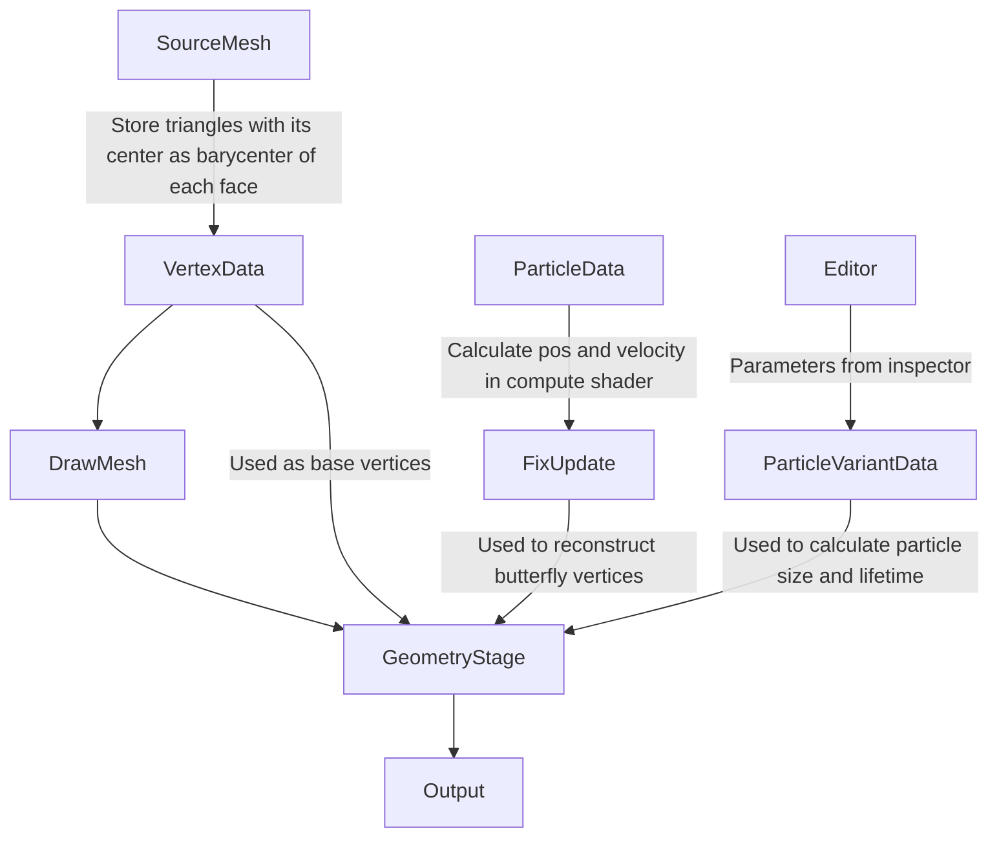
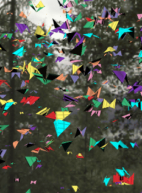
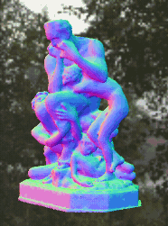

# Firefly

This is an practice of using geometry shader to recontruct particle mesh for implementing special effects.

The original idea is from [*Firefly*](https://github.com/keijiro/Firefly) which is using of Unity ECS, C# Job
System and the Burst compiler, this project moves the calculations into geometry shader and compute shader.

The basic flow listed below represents how it works. At First I convert input source mesh to ComputeBuffer and 
calculate the particle motion through ComputeShader, and then sending those buffers into geometry shader 
to reconstruct butterfly particle mesh.

I also implemented a cpu version in order to correct the calculation of particle motion. To mix particle velocity 
and inverse direction of the particle with the time direction, we can easily control the forward/reverse motion effects.

The cpu version is very slow when applying source mesh with huge vertives. After I move those works into gpu, then we 
can apply on the huge mesh with better performance as well :-)

# Environment
- Unity 2019.4.1f1

# Reference
- https://github.com/keijiro/Firefly
